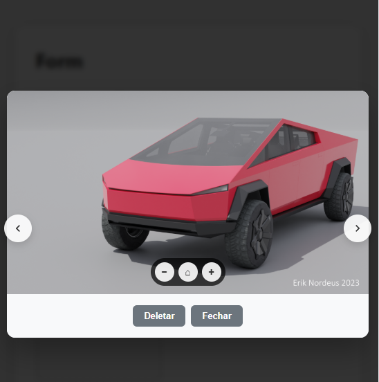

# HpvImagePreviewer

A standalone, extensible JavaScript class for displaying images or galleries in a modal overlay with advanced zoom, pan, navigation, and custom action capabilities. Fully responsive, event-driven, and easily integrated into any web project.

---

## Preview

<div align="center">


*Modal overlay with gallery navigation*


*Zoom and pan controls in action*


*Gallery carousel with thumbnails*


*Fully responsive on desktop and mobile*

</div>

---

## Features

- **Modal Image & Gallery Display**: Show single images or full galleries in a full-screen overlay.
- **Zoom & Pan**: Mouse wheel zoom, pinch-to-zoom, and pan when zoomed.
- **Zoom Controls**: Zoom in/out/reset buttons with press-and-hold for continuous zoom.
- **Gallery Navigation**: Cycle through images with navigation buttons, keyboard arrows, or swipe gestures.
- **Custom Buttons**: Flexible button system with custom handlers, keyboard shortcuts, and styling.
- **Touch Support**: Pinch-to-zoom, swipe navigation, and touch pan.
- **Readonly Mode**: Show/hide buttons based on readonly state.
- **Event Driven**: Emits custom events for integration and analytics.
- **Intelligent Sizing**: Overlay adapts to image aspect ratio and viewport.
- **Reusable**: Single instance can display different images or galleries.
- **Customizable**: Configurable button texts, callbacks, and CSS classes.
- **Accessible**: Keyboard navigation and ARIA-friendly markup.

---

## Quick Start

1. **Include CSS and JS**

```html
<link rel="stylesheet" href="src/css/main.css">
<script src="src/js/main.js"></script>
```

2. **Instantiate and Use**

```javascript
const previewer = new HpvImagePreviewer({
  closeButtonText: 'Close',
  isReadOnly: false,
  buttons: [
    {
      id: 'view',
      label: 'View',
      title: 'View full size image',
      customClasses: ['btn-primary'],
      visibleReadOnly: true,
      clickHandler: (image) => window.open(image.url, '_blank')
    },
    {
      id: 'star',
      label: 'Star',
      title: 'Mark as favorite',
      customClasses: ['btn-star'],
      keyPress: { key: 's', shift: true }, // Triggers with Shift+S
      clickHandler: (image) => alert('Starred: ' + image.alt)
    }
  ]
});

const imageModel = { url: 'path/to/image.jpg', alt: 'Description' };
previewer.show(imageModel);
```

3. **Gallery Mode**

```javascript
const images = [
  { url: 'img1.jpg', alt: 'First' },
  { url: 'img2.jpg', alt: 'Second' }
];
previewer.showGallery(images, 0); // Start at first image
```

---

## API

### Constructor Options

| Option              | Type     | Default   | Description |
|---------------------|----------|-----------|-------------|
| `buttons`           | Array    | `[]`      | Array of custom button configs |
| `closeButtonText`   | string   | `'Close'` | Text for the close button |
| `isReadOnly`        | boolean  | `false`   | If true, only shows buttons with `visibleReadOnly: true` |
| `minScale`          | number   | `1`       | Minimum zoom scale |
| `maxScale`          | number   | `5`       | Maximum zoom scale |
| `onClose`           | function | `null`    | Callback for close button click |
| `onImageSwitch`     | function | `null`    | Callback for gallery navigation |
| `isDebug`           | boolean  | `false`   | Enable debug logging |

### Button Configuration

| Property         | Type     | Required | Description |
|------------------|----------|----------|-------------|
| `id`             | string   | ✅       | Unique identifier |
| `label`          | string   | ✅       | Button text |
| `title`          | string   | ❌       | Tooltip text |
| `icon`           | string   | ❌       | CSS class for icon |
| `visibleReadOnly`| boolean  | ❌       | Show in readonly mode (default: true) |
| `customClasses`  | Array    | ❌       | Extra CSS classes for styling |
| `clickHandler`   | function | ✅       | Called on click: `(image, previewerInstance) => {}` |
| `keyPress`       | Object   | ❌       | Keyboard shortcut: `{ key: 'd', ctrl: true }` |

### Image Model

```js
{
  url: 'string',     // Required: Image URL
  alt: 'string',     // Optional: Alt text
  file: File,        // Optional: Original file object
  // ...any custom properties
}
```

### Methods

- `show(imageModel)`
- `showGallery(galleryImages, activeIndex = 0)`
- `navigateGallery(direction)`
- `hide()`
- `updateOptions(newOptions)`
- `toggleReadOnly()`
- `setReadOnly(isReadOnly)`
- `destroy()`

### Events

| Event Name                        | Detail Payload | Description |
|-----------------------------------|---------------|-------------|
| `hpvImagePreviewer:customButtonClick`| `{ buttonId, image, button }` | Custom button clicked |
| `hpvImagePreviewer:close`            | `{ image }`   | Overlay closed |
| `hpvImagePreviewer:navigate`         | `{ currentImage, currentIndex, previousImage, galleryLength, direction, cycled }` | Gallery navigation occurred |

---

## File Structure

```
src/js/
  main.js                # HpvImagePreviewer class
src/css/
  main.css               # Overlay/modal/gallery styles
src/index.html           # Sample usage
examples/
  image-previewer-standalone.html  # Advanced example
docs/
  HpvImagePreviewer-README.md      # Full documentation
```

---

## Browser Support

- Modern browsers (Chrome, Firefox, Safari, Edge)
- Touch devices (iOS Safari, Android Chrome)
- Requires ES6, CustomEvent, and modern CSS

## Dependencies

- None. Pure vanilla JavaScript and CSS.

---

## License

MIT

---

## Contributing

Pull requests and issues are welcome! Please see [docs/HpvImagePreviewer-README.md](docs/HpvImagePreviewer-README.md) for full documentation and advanced usage.
